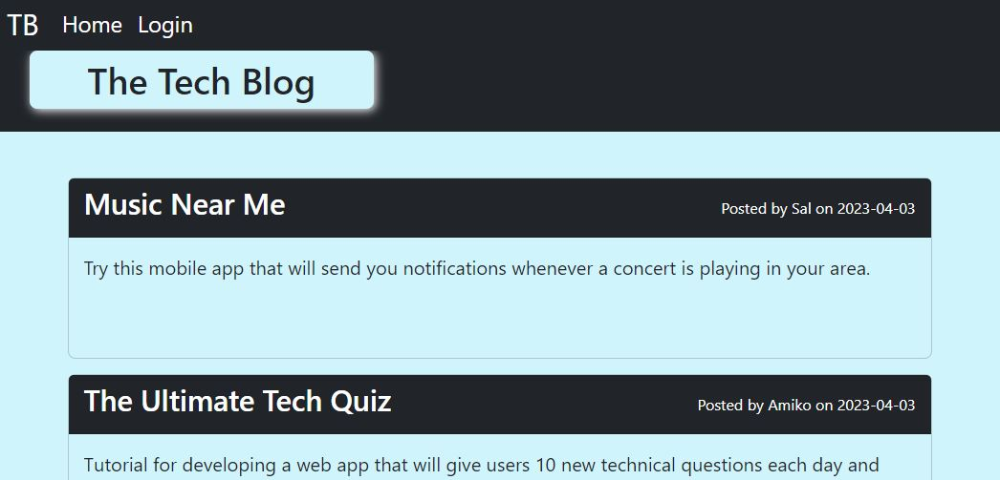

# My Tech Blog 

## Description:

&nbsp; This blogging app is a powerful tool for anyone who wants to create and share content on the web. It provides a simple and intuitive interface for users to write and publish blog posts on a variety of topics. The app also allows users to engage with each other through comments and social sharing, making it an ideal platform for building a community around a particular topic or niche.

Moreover, this app also provides features such as user authentication and authorization, which ensures that users can securely log in and manage their posts and comments. The app also includes an intuitive user interface that allows users to easily navigate and search for content, making it an ideal tool for anyone who wants to explore new ideas or find inspiration for their own blog posts. With its powerful set of features and user-friendly design, this blogging app is an essential tool for anyone who wants to create and share their content with the world.

## Table of Contents:

- [Installation](#installation)
- [Usage](#usage)
- [Tests](#tests)
- [Badges](#badges)
- [How_to_Contribute](#how_to_contribute)
- [Questions](#questions)
- [License](#license)

## Installation:

&nbsp; None

## Usage:

to use the deployed app go to the website and follow below instructions: https://arishorts-mytechblog.herokuapp.com/

1. When a user first visits the website, they are directed to the homepage which displays a list of recent blog posts.
   
2. The user can click on any of the blog post titles to read the full post.
3. If the user wants to interact with the website, they need to sign up or log in first. They can do so by clicking the "Sign Up" or "Log In" button in the navigation bar, which will take them to the respective pages.
4. After logging in, the user can create a new blog post by clicking on the "New Post" button in the navigation bar. They will be directed to a page where they can enter the details of their post.
5. The user can also leave comments on any blog post by clicking on the "Comment" button at the bottom of the post. They will be directed to a page where they can enter their comment.
6. If the user is the owner of a post or a comment, they can edit or delete it by clicking on the "Edit" or "Delete" button respectively. They will be prompted to confirm their action before proceeding.
7. If the user wants to log out, they can click the "Log Out" button in the navigation bar.

   <br>

Alternatively, to use the downloadable code go to the website and follow below instructions: https://github.com/arishorts/my-tech-blog

1. Start by opening a terminal or command prompt and navigating to the directory where the code is located.<br>
2. Run 'npm i' install to install the required packages.<br>

```
npm i
```

3. Save the required information into a .env file saved in the root directory:

```
DB_HOST="________"
DB_USER="_________"
DB_PASSWORD="________"
DB_NAME="techblog_db"
```

4. Enter the command below to be prompted for your password to log in to the MySQL server.

```
mysql -u root -p
```

5. Run the following commands to create the database and seed with values.

```
source db/schema.sql
```

6. Run the following commands to create the database and seed with values.

```
node seeds/seed.js
```

## Tests:
**IMPORTANT!** <br>
****** Be sure to perform these tests in a different database so stored data is not dropped ******<br>
**IMPORTANT!** 
```
User : npm test1
Blogpost : npm test2
Comment : npm test3
```

## Badges:


## How_to_Contribute:

&nbsp; If you would like to contribute, refer to the [Contributor Covenant](https://www.contributor-covenant.org/)

## Questions:

&nbsp; My GitHub profile can be found at: https://github.com/arishorts
<br>&nbsp; Reach me with additional questions at : arieljschwartz@gmail.com

## License:

&nbsp; http://choosealicense.com/licenses/mit/

---

© 2022 Ariel Schwartz LLC. Confidential and Proprietary. All Rights Reserved.
